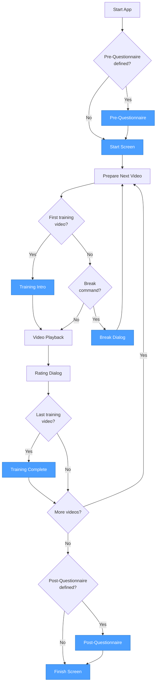

# Running Tests

This section explains how to transfer files to the device, validate configurations, and run the test.

## Transfer Files to Device

The application stores videos, config files, and logs in app-specific storage. Due to Android's scoped storage restrictions (Android 10+), you'll need to use ADB to transfer files.

All files are stored in the app's external storage directory:

```
/storage/emulated/0/Android/data/org.univie.subjectiveplayer/files/
├── SubjectiveCfg/     # Config files
├── SubjectiveMovies/  # Video files
└── SubjectiveLogs/    # Test result logs
```

!!! warning "Running the App Once is Important"

    The app creates necessary storage directories on first run.
    If you copy files to the device before running the app once, the app may not work correctly.

### Using the Push Script

To move your files (videos and config files) to the device automatically, use the provided `push_to_device.sh` script:

```bash
# Push your own test files from a custom directory
examples/push_to_device.sh -d /path/to/your/test/files

# Or push the included example files
examples/push_to_device.sh
```

Run `examples/push_to_device.sh --help` for all options.

### Manual ADB Transfer

Alternatively, use ADB manually to push files to the device:

```bash
# Push video files
adb push your_video.mp4 /storage/emulated/0/Android/data/org.univie.subjectiveplayer/files/SubjectiveMovies/

# Push config files
adb push subject_1.cfg /storage/emulated/0/Android/data/org.univie.subjectiveplayer/files/SubjectiveCfg/
```

## Validate Config Files

The app can validate the config files to ensure all referenced video files exist. This is optional, but recommended.

To validate the config files:

1. Start the app
2. Open the menu (three dots in the top-right corner)
3. Select *Validate Config Files*
4. The app will check all config files in the `SubjectiveCfg` folder and report any missing video files or invalid syntax
5. You can also see which config uses which method, if training is used, and how many videos are in each config

## Run the Test

When you start the app, you can select the config by having the subject enter their respective ID.

The test is self-guided and will show videos, ask for ratings, and handle breaks as defined in the config.

### Session Flow

The following diagram illustrates the flow of a test session:



## Obtain the Results

After a test, the results are stored in the `SubjectiveLogs` folder. Each file corresponds to one subject's rating results. If pre- and/or post-questionnaires were used, their results are included in another file with the same subject ID.

To get the results back to your computer, use ADB to pull the log files:

```bash
adb pull /storage/emulated/0/Android/data/org.univie.subjectiveplayer/files/SubjectiveLogs/ ./SubjectiveLogs/
```

This will copy all log files to your local `SubjectiveLogs/` directory.

See [Output Format](output-format.md) for details on the CSV file structures.
